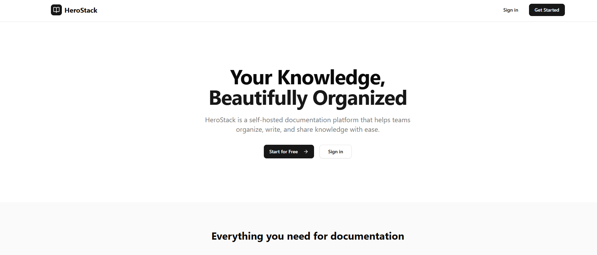

<p align="center">
  
</p>

<h1 align="center">HeroStack</h1>

<p align="center">
  Self-hosted documentation platform built with Next.js 15.<br>
  Organize knowledge into Shelves, Books, Chapters, and Pages.
</p>

<p align="center">
  
</p>

<p align="center">
  <a href="./screenshot">View More Screenshots</a>
</p>

## Features

### Content Management
- **Hierarchical Organization** - Shelves → Books → Chapters → Pages
- **Rich Text Editor** - TipTap-based editor with formatting, code blocks, callouts
- **Drag & Drop Ordering** - Reorder pages and chapters easily
- **Revision History** - Track changes and restore previous versions
- **Tags System** - Organize content with tags across all entity types

### Reading Experience
- **Book Reader Modal** - Read entire books in a fullscreen modal with table of contents
- **Quick Actions** - Hover to reveal Read/Edit buttons on all content lists
- **Page Navigation** - Navigate between pages with prev/next buttons

### Search & Discovery
- **Full-Text Search** - PostgreSQL-powered search across all content
- **Pages Search** - Filter pages by name or book
- **Ranked Results** - Results sorted by relevance with snippets
- **Command Menu** - Quick navigation with Cmd+K

### Teams & Collaboration
- **Team Management** - Create teams and invite members
- **Team-based Content** - Assign shelves and books to teams
- **Invitation Links** - Generate shareable invite links with role assignment
- **Member Roles** - Owner, Admin, Member with different permissions
- **Comments System** - Threaded comments on pages
- **Public Sharing** - Generate read-only links for external sharing
- **Role-Based Access Control (RBAC)**
  - **Admin** - Full access + user management
  - **Editor** - Create, edit, view content
  - **Viewer** - Read-only access

### Import & Export
- **BookStack Import** - Import from BookStack Portable ZIP format
- **PDF Export** - Export pages, chapters, or entire books
- **Markdown Export** - Download content as Markdown files

### Plugin System
- **ZIP Installation** - Install plugins by uploading ZIP files
- **Plugin Management** - Enable, disable, or uninstall plugins from Admin panel
- **Dynamic Menu** - Installed plugins appear in sidebar automatically
- **Plugin Marketplace** - Extend functionality with third-party plugins

### Authentication
- Email/Password login
- Google OAuth
- GitHub OAuth

## Tech Stack

- **Framework**: Next.js 15 (App Router, Turbopack)
- **Database**: PostgreSQL + Drizzle ORM
- **Auth**: Auth.js v5
- **UI**: shadcn/ui + Tailwind CSS
- **Editor**: TipTap
- **Runtime**: Bun

## Quick Start

### Docker Compose

```bash
# Clone repository
git clone https://github.com/your-username/herostack.git
cd herostack

# Setup environment
cp .env.example .env

# Generate AUTH_SECRET and update .env
openssl rand -base64 32

# Run containers
docker compose up -d

# Run database migration (first time only)
docker compose exec app bun run db:push

# Open http://localhost:3056
```

### Local Development

```bash
# Install dependencies
bun install

# Setup environment
cp .env.example .env
# Edit .env with your database URL

# Push database schema
bun run db:push

# Start dev server
bun run dev

# Open http://localhost:3056
```

### Production with PM2

```bash
# Install dependencies
bun install

# Setup environment
cp .env.example .env
# Edit .env with your database URL and AUTH_SECRET

# Build application
bun run build

# Install PM2 globally
npm install -g pm2

# Start with PM2
pm2 start bun --name "herostack" -- run start

# Save PM2 process list
pm2 save

# Auto-start on reboot
pm2 startup
```

**PM2 Commands:**
```bash
pm2 status          # Check status
pm2 logs herostack  # View logs
pm2 restart herostack  # Restart
pm2 stop herostack  # Stop
```

### Production with Systemd

Create `/etc/systemd/system/herostack.service`:

```ini
[Unit]
Description=HeroStack Documentation Platform
After=network.target

[Service]
Type=simple
User=www-data
WorkingDirectory=/var/www/herostack
ExecStart=/usr/local/bin/bun run start
Restart=on-failure
Environment=NODE_ENV=production

[Install]
WantedBy=multi-user.target
```

```bash
# Enable and start
sudo systemctl enable herostack
sudo systemctl start herostack

# Check status
sudo systemctl status herostack
```

## Environment Variables

| Variable | Required | Description |
|----------|----------|-------------|
| `DATABASE_URL` | Yes | PostgreSQL connection string |
| `AUTH_SECRET` | Yes | Random string for session encryption |
| `AUTH_URL` | Yes | Your app URL |
| `AUTH_GOOGLE_ID` | No | Google OAuth Client ID |
| `AUTH_GOOGLE_SECRET` | No | Google OAuth Secret |
| `AUTH_GITHUB_ID` | No | GitHub OAuth Client ID |
| `AUTH_GITHUB_SECRET` | No | GitHub OAuth Secret |

## OAuth Setup

### GitHub OAuth

1. Go to https://github.com/settings/developers
2. Click **"New OAuth App"**
3. Fill in the form:
   - **Application name:** HeroStack
   - **Homepage URL:** `http://localhost:3056` (or your production URL)
   - **Authorization callback URL:** `http://localhost:3056/api/auth/callback/github`
4. Click **Register application**
5. Copy **Client ID** and generate **Client Secret**
6. Add to `.env`:
   ```
   AUTH_GITHUB_ID="your-client-id"
   AUTH_GITHUB_SECRET="your-client-secret"
   ```

### Google OAuth

1. Go to https://console.cloud.google.com/apis/credentials
2. Create a new project or select an existing one
3. Click **"Create Credentials"** → **"OAuth client ID"**
4. If prompted, configure the OAuth consent screen first
5. Select **Application type:** Web application
6. Fill in:
   - **Name:** HeroStack
   - **Authorized JavaScript origins:** `http://localhost:3056`
   - **Authorized redirect URIs:** `http://localhost:3056/api/auth/callback/google`
7. Click **Create**
8. Copy **Client ID** and **Client Secret**
9. Add to `.env`:
   ```
   AUTH_GOOGLE_ID="your-client-id"
   AUTH_GOOGLE_SECRET="your-client-secret"
   ```

> **Note:** For production, replace `http://localhost:3056` with your actual domain.

## Commands

```bash
# Development
bun run dev

# Build
bun run build

# Production
bun run start

# Database
bun run db:push       # Push schema to database
bun run db:generate   # Generate migrations
bun run db:studio     # Open Drizzle Studio
bun run db:seed       # Seed sample content (tutorial)
```

## Plugins

### Installing Plugins

1. Download plugin ZIP file
2. Go to **Admin → Plugins**
3. Drag & drop or click to upload ZIP
4. Plugin will be installed and activated automatically

### Available Plugins

| Plugin | Description |
|--------|-------------|
| [IP Whitelist](https://github.com/IrfanArsyad/herostack-whitelist) | Restrict access by IP address |
| [Doc Summarizer](https://github.com/IrfanArsyad/herostack-doc-summarizer) | Summarize docs from URL using AI |

## License

MIT
